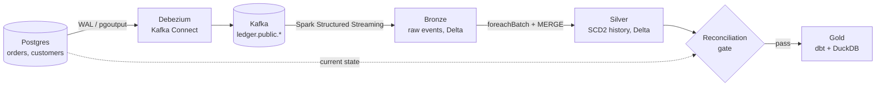

# Ledger: CDC Medallion Lakehouse

Change data capture from Postgres into a Delta Lake medallion lakehouse, with
full SCD Type 2 history, hard-delete propagation, a reconciliation gate, and a
dbt gold layer.

> Personal project. All data is synthetic (generated by `ledger.simulate` or
> `ledger.fixtures`).



| Layer | What it holds | Code |
|---|---|---|
| Bronze | Raw Debezium JSON + Kafka topic/partition/offset, append-only | `src/ledger/jobs/bronze.py` |
| Silver | One row per source version: `valid_from`, `valid_to`, `is_current`, `is_deleted` | `src/ledger/jobs/silver.py` |
| Gate | Source current state vs. silver current state | `src/ledger/reconcile.py` |
| Gold | `dim_customers` (SCD2), `fct_orders`, `fct_daily_revenue` | `dbt/models/marts/` |

## Design decisions

**Reading the WAL instead of querying tables.** Debezium tails the Postgres
write-ahead log through a logical replication slot, so the pipeline never runs
repeated `SELECT *` extracts against the source. The cost is a replication slot
that must be monitored (it holds WAL until consumed) and `REPLICA IDENTITY FULL`,
which makes Postgres log the whole old row on updates and deletes.

**History ordered by commit order (LSN + Kafka offset).** `valid_from` is the
source commit time. Ordering by the row's own `updated_at` looks tempting but
breaks with backdated corrections: a fix committed today but stamped yesterday
would sort before this morning's status change, and the stale amount in that
older row image would become "current". Ties within one transaction are broken
by Kafka offset (Debezium keys by primary key, so a row's changes share a
partition). See the docstring in `src/ledger/scd2.py`.

**Backdated corrections are restated in gold.** Silver records a correction
when it was committed (an audit trail of what was known when). Gold attributes
each order's latest amount to its `order_date`, so `fct_daily_revenue` restates
the day the correction belongs to.

**Rebuild-per-touched-key + one atomic MERGE.** For each micro-batch the silver
job collects the keys it touched, rebuilds their full history from bronze, and
applies inserts, updates and stale-version deletes in a single Delta `MERGE`.
Rebuilding is a pure function of bronze, so:

* re-running a batch after a crash produces the same rows (the MERGE is a no-op),
* Debezium's at-least-once replays are collapsed (identical events -> lowest offset),
* readers never see a half-applied batch.

The trade-off is re-reading bronze for touched keys each batch, which is fine at
this scale; at larger scale bronze would be Z-ordered or clustered by key.

**Deletes keep history.** A hard delete becomes a final version with
`is_deleted = true` that carries the last known values (from Debezium's `before`
image). Point-in-time queries before the delete still see the row; gold excludes it.

**Reconciliation compares states, not row counts.** Silver keeps every
version, so raw counts never match the source. The gate compares *current*
state per key: missing keys, extra keys (missed deletes), per-column value
differences, and the total amount. A failure exits non-zero and `make promote`
stops before gold.

## Run it

Requirements: Docker, Python 3.11+, Java 17 (for Spark).

```bash
python -m venv .venv && source .venv/bin/activate
make install            # package + Spark + dbt + test deps
make up                 # Postgres (wal_level=logical), Kafka, Kafka Connect
make connector          # register the Debezium connector
make simulate           # synthetic inserts, updates, deletes, backdated fixes
make bronze             # Kafka -> bronze (drains, then stops)
make promote            # silver -> reconciliation gate -> dbt build
make benchmark          # optional: daily revenue on Postgres vs. gold
```

No Docker? `make dbt-fixture` builds a synthetic silver lake with the pandas
reference implementation and runs the full dbt build + tests on it.

To run the lake on Azure ADLS Gen2 instead of `./lake`, apply `infra/azure`
with Terraform and set `LAKE_ROOT`, `AZURE_STORAGE_ACCOUNT` and
`AZURE_STORAGE_KEY` (see `.env.example`).

## Tests

| Suite | What it checks | Where |
|---|---|---|
| pytest | Debezium parsing, SCD2 rules (deletes, backdated fixes, replays, same-LSN changes, reinsert after delete), reconciliation | `tests/` |
| pytest + Spark | Spark job output equals the pandas reference; MERGE is idempotent and removes stale versions | `tests/test_spark_silver.py` |
| dbt (50 tests) | uniqueness, not-null, accepted values, relationships, one current version per key, no overlapping validity windows, gold totals reconcile to detail rows, no deleted orders in gold | `dbt/` |

CI (`.github/workflows/ci.yml`) runs lint, pytest with Spark, `dbt build` on the
fixture lake, and `terraform validate` on every push and pull request.

## Results

Fill these in from your own runs (`make simulate` with your settings, then `make benchmark`):

| Metric | Value | Conditions |
|---|---|---|
| Change events processed | _tbd_ | simulator settings, run length |
| Daily-revenue query, Postgres | _tbd_ | machine, row count, median of N warm runs |
| Daily-revenue query, gold | _tbd_ | same |

## Known limitations

* Single-node Spark (`local[*]`) and single-broker Kafka; not a production deployment.
* Silver rebuild re-reads bronze for touched keys; no bronze compaction or retention yet.
* Schema evolution in the source (new columns) requires updating `src/ledger/tables.py`.
* The replication slot is not monitored; in production, alert on slot lag.
